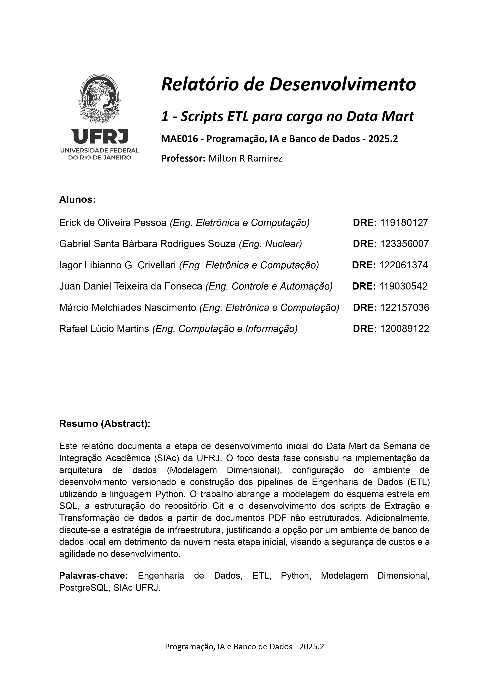

# PBD-SIAC-Datamart

Projeto de Data Mart para análise de dados do Sistema Integrado de Atividades Curriculares (SIAC) da UFRJ. Implementa processos ETL para extração, transformação e carga de dados de cadernos de resumos acadêmicos.

## Descrição

O projeto consiste em um Data Mart dimensional que permite análise multidimensional de trabalhos acadêmicos submetidos ao SIAC. Os processos ETL extraem dados de arquivos PDF, transformam e estruturam as informações em um modelo dimensional para análise.

## Estrutura de Diretórios

```
├── data/              # Dados brutos (PDFs) e processados (JSON)
├── docs/              # Documentação técnica do projeto
├── etl_scripts/       # Scripts Python para ETL
├── sql_schemas/       # Scripts SQL auxiliares
├── sql_table_schemas/ # DDL do Data Mart
├── dashboards/        # Dashboards e visualizações
└── requirements.txt   # Dependências Python
```

## Componentes Principais

### ETL Scripts

- `extract.py`: Extração de links e download de PDFs do site SIAC
- `transform.py`: Parsing de PDFs e transformação em estruturas JSON
- `utils_text.py`: Funções auxiliares para limpeza e padronização de texto

### Schema do Data Mart

O modelo dimensional implementado em `sql_table_schemas/siac_datamart_ddl.sql` possui:

**Dimensões:**

- `Dim_Tempo`: Análise temporal de submissões
- `Dim_Local`: Instituições e localizações geográficas
- `Dim_Pessoa`: Autores e coautores
- `Dim_Trabalho`: Características dos trabalhos acadêmicos

**Fato:**

- `Fato_Resumo`: Tabela fato central com métricas e relacionamentos

## Requisitos

- Python 3.8+
- PostgreSQL (recomendado para o Data Mart)
- Bibliotecas listadas em `requirements.txt`

## Instalação

```bash
pip install -r requirements.txt
```

## Workflow

1. Extração de PDFs do site SIAC
2. Parsing e transformação de dados em JSON
3. Carga no Data Mart (PostgreSQL)
4. Análise através de queries SQL ou dashboards

## Política de Contribuição

Pull requests são obrigatórios para merge na branch main. Todos os commits devem passar por revisão antes da integração.
